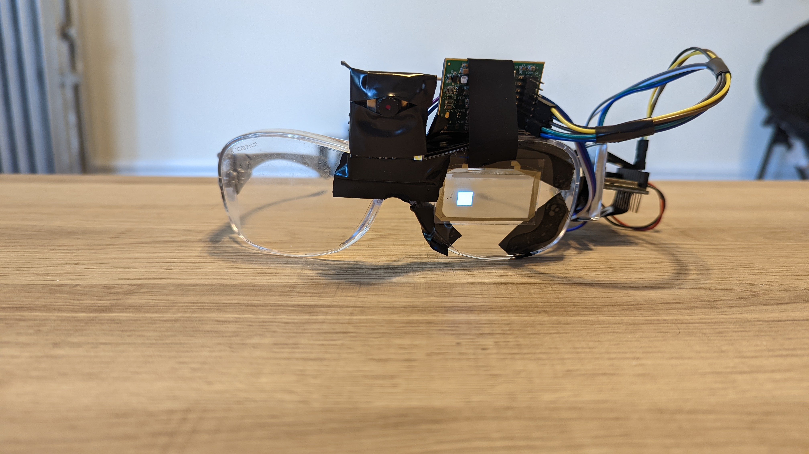

# EDITH
###### Open-source smart glasses 
###### By Chris Uustal | Northwestern University EE327 | Spring '22

### What is this? 
A thing I designed for a project course. It's supposed to be based off the EDITH smart glasses from
the spiderman movies, but basically all it is is a transparent display with a camera
that does face recognition. It also has a very basic websocket interface
you can use to reconfigure somet things like the display brightness and turn it on and off
as well as see the basics of what the face recognition is seeing. 

It isn't super fancy or even that great, but it was really fun to build. 

### Components
Adafruit ESP32 - Hosting the webserver and connected to the display
Transparent OLED Display from CrystalFontz (128x56) - Displays things
ESP32-CAM - Does the camera and face recognition stuff 
1200mAh Battery - Lets me operate it wirelessly! 

### Pics

### Support
No. Don't expect me to every update this or even respond to inquiries if you're trying to copy it. 
Sorry. 